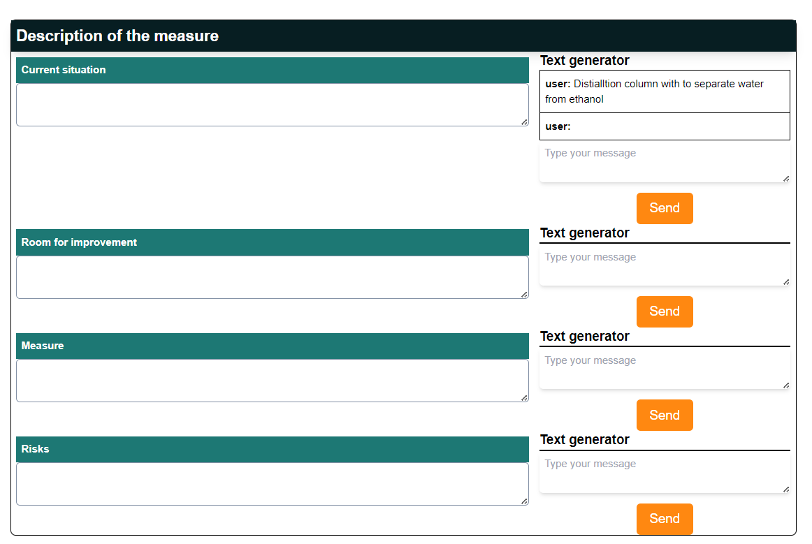

## React Demo Project

### Installation

To install the project, please follow the steps below:

1. Clone the repository to your local machine using the command `git clone <repo name>`.
2. Navigate to the project directory using the command `cd react-demo-project`.
3. Install all dependencies by running `npm install`.

### Running the project

To run the project, please follow the steps below:

1. Ensure all dependencies are installed by running `npm install`.
2. Start the development server by running `npm start`.
3. The project will be available on `http://localhost:3000`.

 ## Preview
